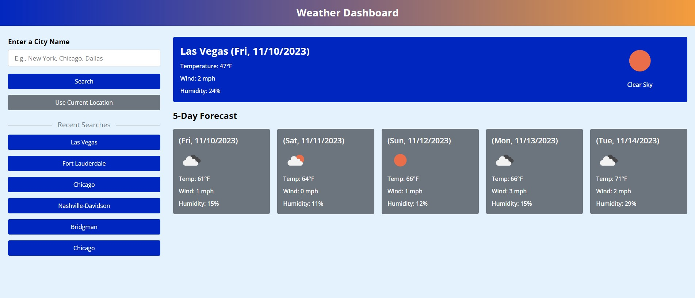

# Weather-Dashboard
A 5-day weather dashboard using HTML, CSS, and JavaScript

## Description

This is a weather dashboard built with HTML, CSS, and JavaScript. Data is collected and displayed from openweathermap.org. Recent searches are saved in local storage and displayed on page for easy access to frequently requested weather data.

## Installation

Follow the link to see the page! ==> 

## Usage

Type in the name of the desired city and hit "Enter" or click the search button to get the current and 5-day forecast.   

## Credits

https://www.codingnepalweb.com/weather-app-project-html-javascript/ used for ideas on setting up JS code. 

## License
N/A